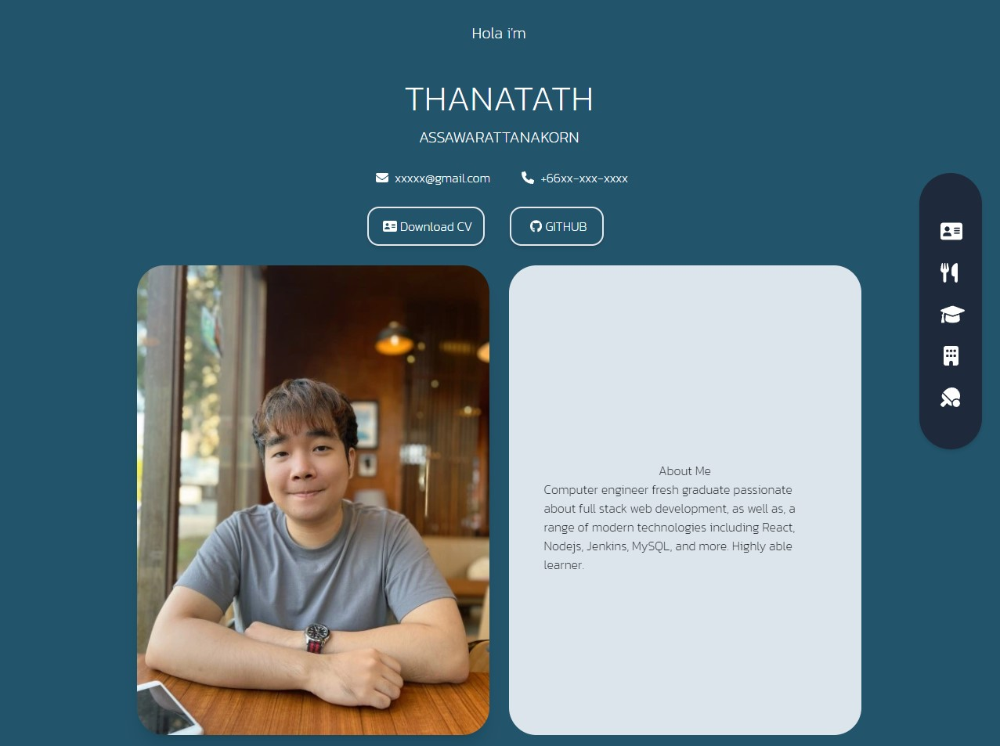

# my-portfolio

## Table of Contents

- [About](#about)
- [Getting Started](#getting_started)
- [Usage](#usage)
- [Contributing](../CONTRIBUTING.md)

## About <a name = "about"></a>

Website contains link to my gallery and project





## Getting Started <a name = "getting_started"></a>

These instructions will get you a copy of the project up and running on your local machine for development and testing purposes. See [deployment](#deployment) for notes on how to deploy the project on a live system.

### Prerequisites

What things you need to install the software and how to install them.

```
git clone https://github.com/thanatath/myportfolio.git
```

### Installing

A step by step series of examples that tell you how to get a development env running.

Start local server

```
npm run start
```

Build website for production

```
npm run build
```

Build website for production & firebase deployment

```
npm run firebase
```

## Usage <a name = "usage"></a>

Don't forgot to add data.js file in component folder and create object for portfolio data
```
export const me_info = {
  name: '',
  lname: '',
  pic: '',
  about_me:
    "",
  email: '',
  phone: '',
  cv: '',
  github: '',
  linkedin: '',
  medium: '',
  };

export const skilldatas = [
  {
    label: '',
    data: '',
  },
  {
    label: '',
    data: '',
  },
  {
    label: '',
    data: '',
  },

];


export const education = [
  {
    label: '',
    pic:'',
    major: '',
    gpa:'',
    year: '',
  },
];

export const work = [
{
    project: '',
    type: '',
    github: '',
    url: '',
    detail: '',
    stack: '',
    stack_detail: [''],
    year: '',
    pic: '',
  }
  
];


export const award = [
  {
    label:'',
    detail:'',
    link:'',
    pic: ''
  }
  
];
```
